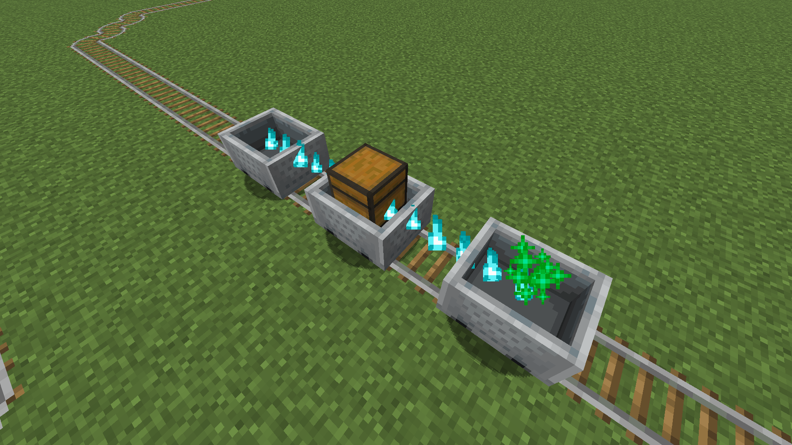
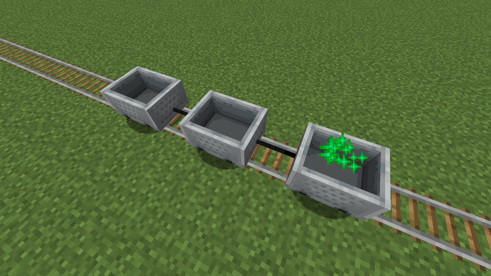
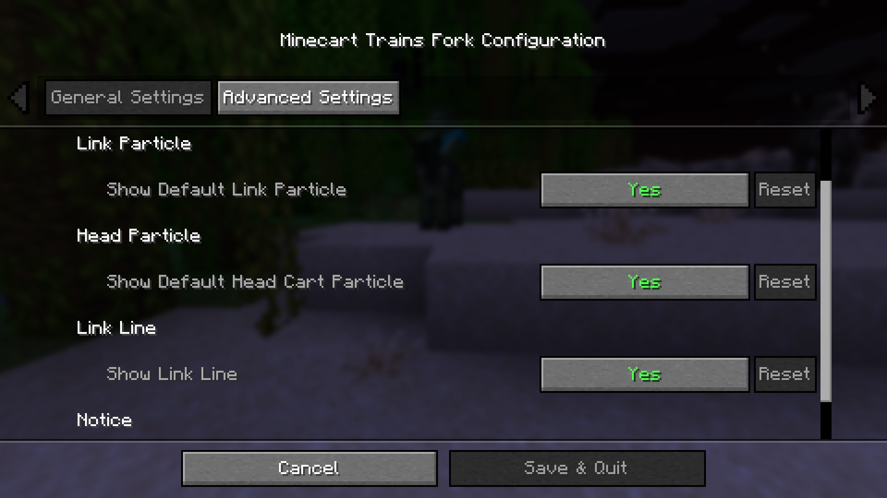
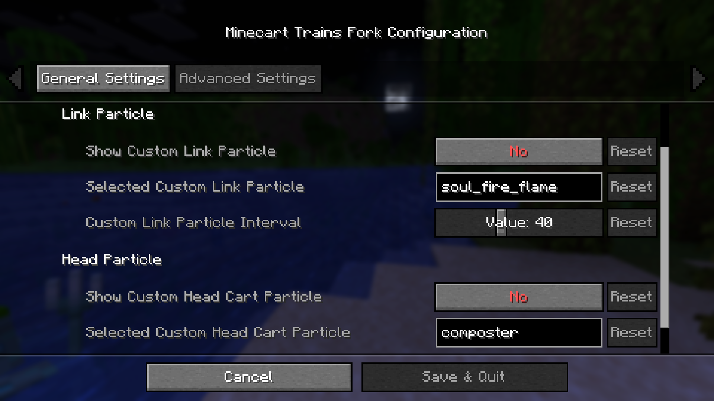
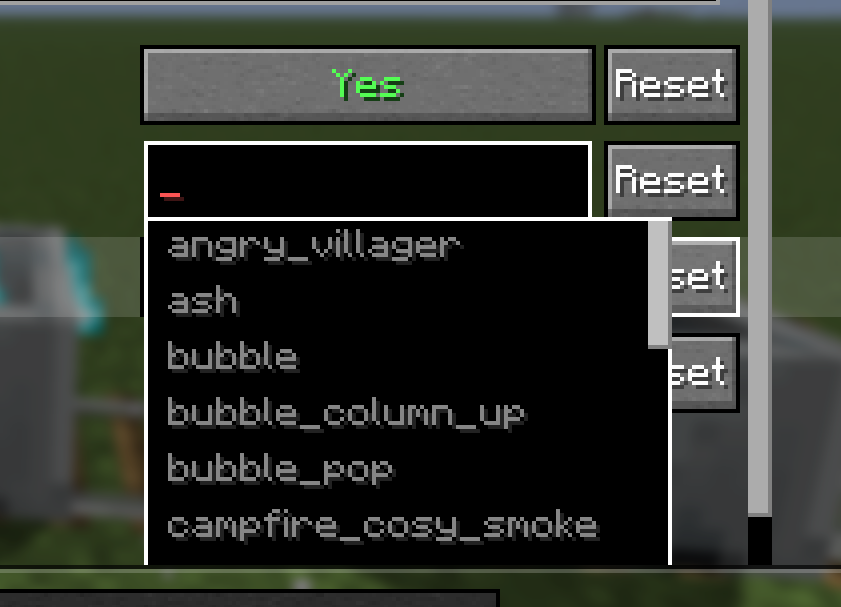

# Minecart Trains Fork

This mod was forked from [Minecart Trains Mod](https://github.com/Larsens-Mods/minecart-trains).

- This mod allows you to build more realistic Minecart trains in Minecraft while trying to stay close to vanilla mechanics.
- The **server** is responsible for connecting the vehicles, and the **client** is responsible for rendering the connection effect. (This means that each client can customize their display.)

## Loader

[![Fabric](https://img.shields.io/badge/Available%20for-Fabric-dbd0b4?logo=data:image/png;base64,iVBORw0KGgoAAAANSUhEUgAAABIAAAAUCAYAAACAl21KAAAACXBIWXMAAA7EAAAOxAGVKw4bAAADpklEQVQ4jZXSW2hbdRwH8O//XHJO0+aetGmytLm0umbrvZ3OytauWBl0KA7RPcgeBB/0QScIQ/RJRGHCHuoFtQpT9EEQb4yN4fVlsC4ba7uMriatrWvanDT3y8nJOSd/X1S2dXXz+/zlw+/H7wfcQ4Z6w/0PDO+Mh8Oupu067N2QwcHeh9u8rlOPPzbesRTbCLY2u35fW5eSt/eYu0GE1CdbWuw7D+wbITt89qdFkTu+u8MX+t8QQzSHpirIZUp4/dVXMH7goSNGU+NZAJabe9uuNur3i94O34mnDk8e9niam06f+RH+dg/cLU4EQkFrIrE23upwn99IpVLbQn19fVbOzB+8vzPw1r6RAYvdbkE8vgwCwGa3wt3qIpmM5C0Ui4LTal1Zl9LJO0IBj/Wo0ch/cuzF53lXsw0tTgdGHhzEyamPwBADgu0+TEzsx/z81YHERqZL2sx8tgXaM7Tr7UcnRl949ugRm8NugqLIUGsqeIOAgeFBrK6u4peff0UwdB9mIpdRLJd9Po/7mX+hnp6exoDb8sTY2N7j3btC3s5gGwgLUFoHBaDrFAaBQ7lUglxRIUlZlMoyKMBUq7Kd+wfitVI/28B+fvCR/byn1QkAIABEUYSi1FAslEABBAN+NIgWvPf+NIaGh0FYnqYz+SwDAHsGwy9393d9/+n0FO9tcaJalpHezIJSAgIC0WCAy+lATdahahrA6KCU4kLkIubn5j6+EIk6uL1D3Se7wh1P9u4O2QjRAKqD4zk0MEaUShUQQsCzLATBAAC4vhBHdHF5U9PxGsNwcUZQFwCAo1R7aUerG6FgEIpSg8hz4HgWDMciV5Gh64DGs2BYDplsHouxP/OXr1x7d2Z24cObj8RRAr1UqTLJVIbUFAWdIT9EgQchddjtVkipNPKFMnKFMj6YPlWXsoUTc1fjb95+bdbjdf6myKo/n8sHml3N0OsUBECDUQBAIMtVLC2v4bvT53A9tvYG4RqnJEmqboESic0Vh9laKJTKo2azqUkQeHA8B47lUNcp4ksrmI3G6MVLc2dVmj8WjS4X7vTELADcWE8usKCFpLR+yNfmBSEEslyDqmr49oczmInM/hS5sjiZSlW2THILBAA2ho9JufxSJl8c1XRVEAURX3z5FTakLCj48zcSya+3Q26BstWqUpZr8xazyUZpvV2t1cxLy6soFKt/sODfSSSTi/cE/Z16Ukqfs5iExo2kNEbBgDDkucjstW/+CwGAvwAUxX1hlnD3nAAAAABJRU5ErkJggg==)](https://fabricmc.net)

## Environment

## Releases

  

## Compatibility

- Fabric API (Required)
- Cloth Config API (Recommended)
- Mod Menu (Recommended)

## Progress

Check out the latest development progress here. [Development Progress](https://windysky.gitbook.io/main/minecraft/minecart-trains-fork/version)

## Features

> [!TIP]
> In short, connect with **Iron Chain** and untie with an **Axe**.
- Currently the mod only allow you to chain Minecarts together. This is done by sneak-clicking the first cart of your train with a **iron chain** in your hand and then on the next one down. This process can be repeated as often as desired to construct your train.

> [!NOTE]
> For example, if I need to connect from car A to car D, the order of clicking while stealthed is: **A, B, B, C, C, D**
- When you hold the iron chain, you enter grouping mode; switching to other items will exit grouping.
- You can use any **axe** to ungroup a Minecart while sneaking by right-clicking.

> [!NOTE]
> You can use the axe to remove any connection at any time.
- Only the front cart can be pushed by the player and is the only one to be affected by booster rails, all other cars just act as wagons. Chaining works with all types of Minecarts.
- The client can change the rendering effects. (Some complex particles are not supported.)

