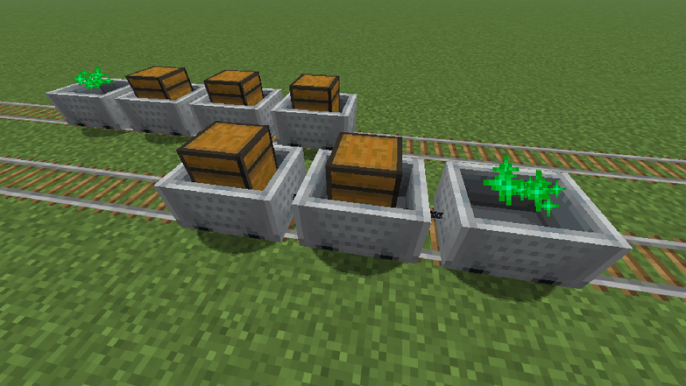
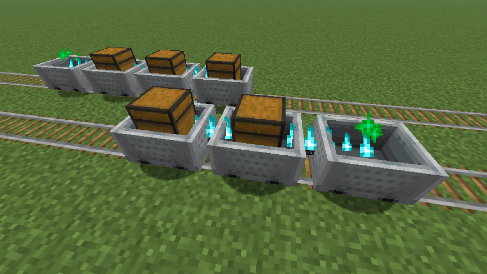
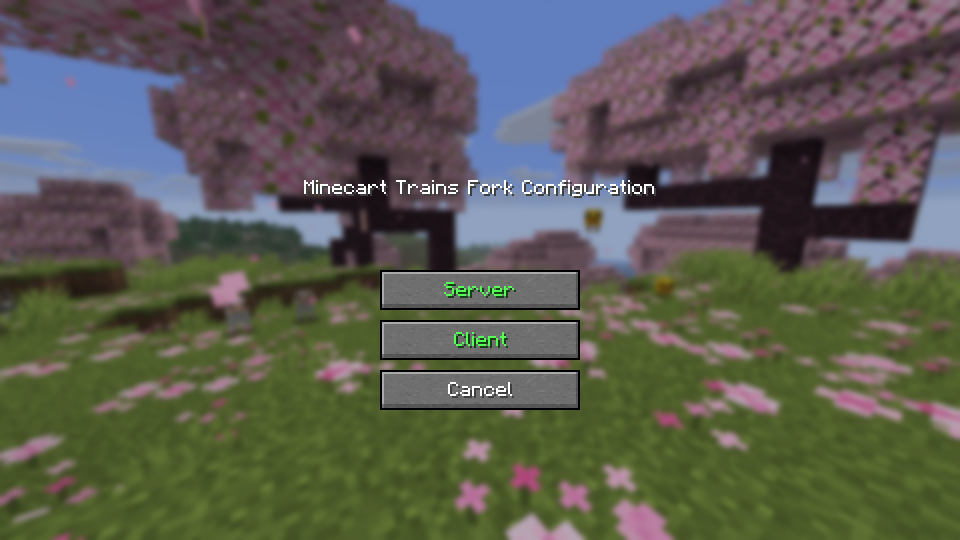
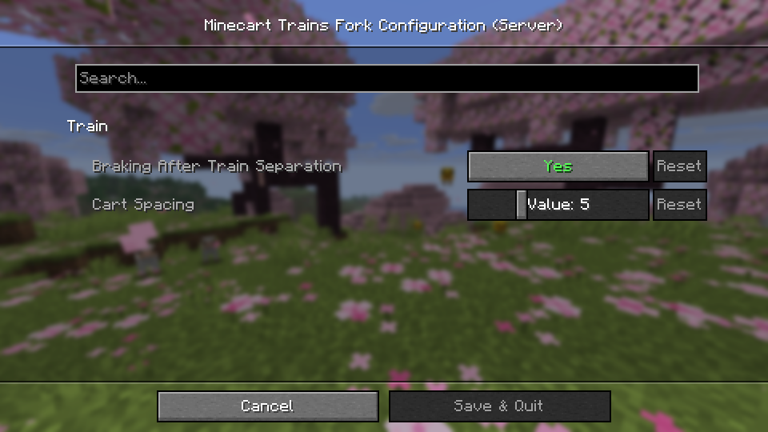
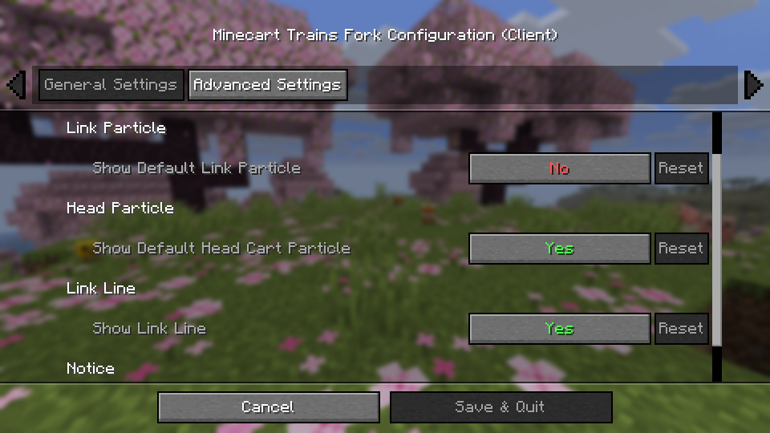

# Minecart Trains Fork

This mod was forked from [Minecart Trains](https://github.com/Larsens-Mods/minecart-trains).

- This mod allows you to build more realistic Minecart trains in Minecraft while trying to stay close to vanilla mechanics.
- The **Server** is responsible for connecting the carts, and the **Client** is responsible for rendering the connection effect.

## Loader

[](https://fabricmc.net)
[](https://neoforged.net)
[](https://files.minecraftforge.net/)

## Environment


## Releases

[](https://github.com/KSSJW/minecart-trains-fork/releases)
[](https://modrinth.com/mod/minecart-trains-fork)
[](https://www.curseforge.com/minecraft/mc-mods/minecart-trains-fork)

## Compatibility

### Fabric

[Fabric API](https://github.com/FabricMC/fabric-api)

[Cloth Config API](https://github.com/shedaniel/cloth-config)

[Mod Menu](https://github.com/TerraformersMC/ModMenu)

| Server Mod        | Relation      | Description |
| :---------------- | :------------ | :--- |
| Fabric API        | **Required**  | - |
| Cloth Config API  | Optional      | Train Behavior Configuration |

| Client Mod        | Relation      | Description |
| :---------------- | :------------ | :--- |
| Fabric API        | **Required**  | - |
| Cloth Config API  | Optional      | Client Display Configuration |
| Mod Menu          | Optional      | Client Configuration Entry |

### NeoForge / Forge

[Cloth Config API](https://github.com/shedaniel/cloth-config)

| Server Mod        | Relation      | Description |
| :---------------- | :------------ | :--- |
| Cloth Config API  | Optional      | Train Behavior Configuration |

| Client Mod        | Relation      | Description |
| :---------------- | :------------ | :--- |
| Cloth Config API  | Optional      | Client Display Configuration |

## Progress

Check out the latest development progress here. [Development Progress](https://www.windysky.top/docs/minecraft-java-edition/minecart-trains-fork/version)





## Features

### Train Behavior

- The child cart moves following the parent cart, **Unaffected** by certain additional forces.
- After installing `Cloth Config API`, you can adjust certain features.

### Train Formation

- Hold the **Iron Chain** in your **Right Hand**.
- Enter **Sneaking** mode, and **Right-click** on a **Minecart**.
- Enter **Sneaking** mode, and **Right-click** on another **Minecart**.
- Repeat the connection operation. (For example, if you need to connect from cart A to cart D, and A is the **Leading** cart. The order of clicking while stealthed is: **A -> B; B -> C; C -> D**. The subsequently selected vehicle will be towed by the previously selected vehicle.)

### Train Decoupling

You can attempt to clear the train connection at **Any Time**, including in cases where the connection fails.

- Hold any **Axe** in your **Right Hand**.
- Enter **Sneaking** mode, and **Right-click** on a **Minecart**.

### Configuration

Configuration files that will be generated after installing `Cloth Config API`:

- `.../config/minecart-trains-fork-server.json`
- `.../config/minecart-trains-fork-client.json`

```
minecart-trains-fork-server.json
    [brakingAfterTrainSeparation] Value: true/false, Default: true
    [cartSpacing] Range: 3 - 10, Default: 5

```






